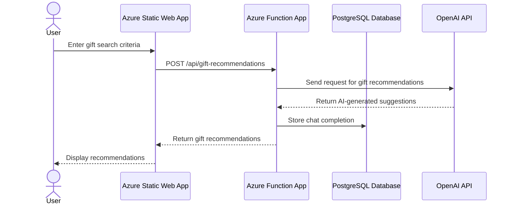

# Gift Finder

Gift Finder is a cloud-based application designed to help users find the perfect gift using AI-powered recommendations. The system is built with a modern architecture, leveraging Azure services, a PostgreSQL database, and the OpenAI API for intelligent responses.

---

## System Architecture

The system consists of the following main components:

### 1. **Frontend**
- **Technology**: Azure Static Web Apps
- **Description**: 
  - The frontend provides a user-friendly interface for interacting with the application.
  - It communicates with the backend via HTTP requests to fetch data and display AI-generated recommendations.
  - Hosted as a static web app on Azure for scalability and performance.

### 2. **Backend**
- **Technology**: Azure Function App (Java-based)
- **Description**:
  - The backend is implemented as serverless functions using Azure Function App.
  - It handles requests from the frontend, processes data, and interacts with the database and OpenAI API.
  - The backend is designed to scale automatically based on demand.

### 3. **Database**
- **Technology**: PostgreSQL (hosted on Azure Database for PostgreSQL)
- **Description**:
  - The database stores user data, chat completions, and other application-related information.
  - Stored procedures are used for secure and efficient data operations.
  - Connection details are securely managed using Azure App Settings.

### 4. **OpenAI API**
- **Technology**: OpenAI GPT API
- **Description**:
  - The OpenAI API is used to generate intelligent responses and recommendations based on user input.
  - The backend invokes the API to process user queries and return AI-powered results.

---

## Sequence Diagram


# Data Base description

## Таблици
---

### 1. `md_question_topic_template`
- **Описание**: Шаблон за тема на анализ.
- **Колони**:
  - `id`: Уникален идентификатор на шаблона (първичен ключ).
  - `seq_no`: Пореден номер на темата.
  - `name`: Наименование на темата.
  - `system_question`: Откриващ въпрос от системата.
  - `system_prompt`: Системен промпт въпрос.
  - `system_check_prompt`: Системен промпт за проверка на отговор.
  - `confirmation_question`: Въпрос за потвърждение от потребителя.
  - `response_structure`: Структура на очаквания отговор (JSONB).

---

### 2. `md_question_topic_element_template`
- **Описание**: Шаблон за елементи към въпросна тема.
- **Колони**:
  - `id`: Уникален идентификатор на елемента (първичен ключ).
  - `md_topic_template_id`: Референция към шаблон на тема (външен ключ към `md_question_topic_template`).
  - `seq_no`: Пореден номер на елемента.
  - `name`: Наименование на елемента.
  - `extraction_question`: Въпрос за извличане на отговор.

---

### 3. `od_user`
- **Описание**: Съдържа информация за потребителите в системата.
- **Колони**:
  - `id`: Уникален идентификатор на потребителя (първичен ключ).
  - `name`: Име на потребителя.
  - `email`: Уникален имейл адрес на потребителя.
  - `secret_key`: Секретен ключ за идентификация.
  - `remaining_requests`: Оставащи заявки за потребителя (по подразбиране: 10).

---

### 4. `od_conversation`
- **Описание**: Съдържа информация за разговорите с потребителите.
- **Колони**:
  - `id`: Уникален идентификатор на разговора (първичен ключ).
  - `od_user_id`: Референция към потребителя (външен ключ към `od_user`).
  - `name`: Наименование на разговора.
  - `started_at`: Начален момент на разговора.
  - `ended_at`: Краен момент на разговора.

---

### 5. `od_conversation_topic`
- **Описание**: Теми в разговорите.
- **Колони**:
  - `id`: Уникален идентификатор на темата (първичен ключ).
  - `od_conversation_id`: Референция към разговор (външен ключ към `od_conversation`).
  - `md_topic_template_id`: Референция към шаблон на тема (външен ключ към `md_question_topic_template`).
  - `user_response`: Потребителски отговор.
  - `structured_response`: Структуриран отговор (JSONB).
  - `status`: Статус на темата (стойности: `new`, `open`, `closed`).

---

### 6. `od_communication`
- **Описание**: Комуникация по тема в разговор.
- **Колони**:
  - `id`: Уникален идентификатор на комуникацията (първичен ключ).
  - `od_conversation_topic_id`: Референция към тема в разговор (външен ключ към `od_conversation_topic`).
  - `started_at`: Начало на комуникацията.
  - `system_prompt`: Системен промпт.
  - `user_response`: Потребителски отговор.
  - `processing_duration_ms`: Продължителност на обработката (в милисекунди).
  - `llm_result`: Резултат от LLM обработката (JSONB).

---

## ER диаграма

```mermaid
erDiagram

    md_question_topic_template {
        int id PK
        int seq_no
        text name
        text system_question
        text system_prompt
        text system_check_prompt
        text confirmation_question
        jsonb response_structure
    }

    md_question_topic_element_template {
        int id PK
        int md_topic_template_id FK
        int seq_no
        text name
        text extraction_question
    }

    od_user {
        int id PK
        text name
        text email
        text secret_key
        int remaining_requests
    }

    od_conversation {
        int id PK
        int od_user_id FK
        text name
        timestamp started_at
        timestamp ended_at
    }

    od_conversation_topic {
        int id PK
        int od_conversation_id FK
        int md_topic_template_id FK
        text user_response
        jsonb structured_response
        text status
    }

    od_communication {
        int id PK
        int od_conversation_topic_id FK
        timestamp started_at
        text system_prompt
        text user_response
        int processing_duration_ms
        jsonb llm_result
    }

    md_question_topic_template ||--o{ md_question_topic_element_template : "has elements"
    md_question_topic_template ||--o{ od_conversation_topic : "used in"
    od_user ||--o{ od_conversation : "starts"
    od_conversation ||--o{ od_conversation_topic : "contains topics"
    od_conversation_topic ||--o{ od_communication : "has communications"